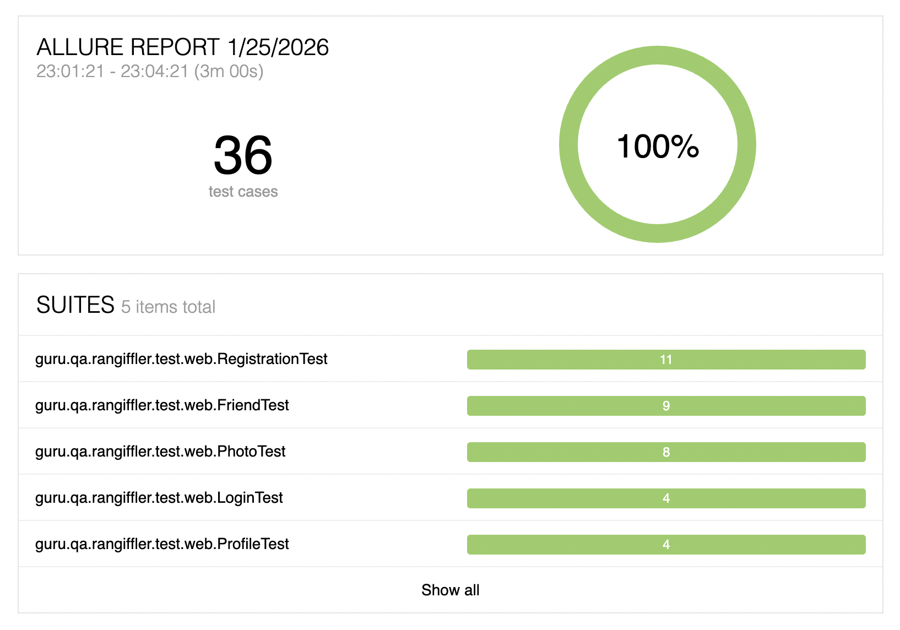

# Rangiffler

Приветствую!
Если ты это читаешь - то ты попал в репозиторий дипломного проекта QA.GURU Java Advanced.

Это проект Rangiffler - сервис, созданный для того, чтобы делиться с друзьями своими классными фотографиями из путешествий.

Приложение реализовано на микросервисной архитектуре. Отдельные модули обмениваются данными с помощью gRPC, 
а общение с Gateway происходит по средствам GraphQL. Также для корректной работы с API и UI сервиса требуется
использование токена, так что будь готов зарегистрироваться и авторизоваться.

Сервис Gateway является единой точкой входа в приложение и обрабатывает все входящие запросы.

# Структура Rangiffler
Как было сказано ранее, Rangiffler построен на базе микросервисной архитектуры. Детальнее с схемой взаимодействия
сервисов друг с другом можно ознакомиться на изображении ниже.


## Стэк проекта
- Java 21
- JUnit 5 (Extensions, Resolvers, etc)
- PostgreSQL
- Selenide
- Gradle
- Spring Authorization Server
- Spring OAuth 2.0 Resource Server
- Spring Data JPA
- Spring Web
- Spring Actuator
- Spring gRPC
- Spring GraphQL
- Apache Kafka
- Docker
- Docker-compose

# Локальный запуск приложения
Для корректной локальной работы сервиса первоначально необходимо установить Docker Images. Сделать это можно с помощью следующих команд:
```posh
docker pull postgres:15.1
docker pull confluentinc/cp-zookeeper:7.3.2
docker pull confluentinc/cp-kafka:7.3.2
```

После `pull` вы увидите спуленный image командой `docker images`

```posh
~ % docker images            
REPOSITORY                 TAG              IMAGE ID       CREATED         SIZE
postgres                   15.1             9f3ec01f884d   10 days ago     379MB
confluentinc/cp-kafka      7.3.2            db97697f6e28   12 months ago   457MB
confluentinc/cp-zookeeper  7.3.2            6fe5551964f5   7 years ago     451MB
```

Для того, чтобы не потерять данные после того, как контейнеры будут остановлены, рекомендуется
создать docker volume, который будет хранить данные локальной БД между сессиями. Сделать этом можно
с помощью выполнения следующей команды в терминале:
```posh
rangiffler-diploma % docker volume create pgdata
```

Для локального запуска всех микросервисов Rangiffler реализован скрипт `localenv.sh`, который
находится в корневой папке проекта.
После запуска скрипта вы должны увидеть spring-log по каждому запущенному сервису. Также скрипто можно запустить
через консоль с помощью терминал:
```posh
rangiffler-diploma % bash localenv.sh
```

Чтобы убедиться в корректном запуске всех сервисов в Docker, стоит выполнить следующую команду:
```posh
docker ps
```

Если в консоле отображаются все запущенные сервисы, как показано ниже, то можно проводить тестирование:
```posh
CONTAINER ID   IMAGE                             COMMAND                  CREATED          STATUS          PORTS                                        NAMES
b4759db53249   confluentinc/cp-kafka:7.3.2       "/etc/confluent/dock…"   19 minutes ago   Up 19 minutes   0.0.0.0:9092->9092/tcp                       kafka
5579fa1f58f5   confluentinc/cp-zookeeper:7.3.2   "/etc/confluent/dock…"   19 minutes ago   Up 19 minutes   2888/tcp, 0.0.0.0:2181->2181/tcp, 3888/tcp   zookeeper
e9fd38df2c3c   postgres:15.1                     "docker-entrypoint.s…"   19 minutes ago   Up 19 minutes   0.0.0.0:5432->5432/tcp                       rangiffler-all
```

После окончания работы с сервисом, вы можете выполнить скрипт `localenv-stop.sh`, который также
находится в коревой папке проекта. Скрипт проверит PID процессов, которые запущены на портах
сервисов и автоматически завершит их выполнение. Или через терминал:
```posh
rangiffler-diploma % bash localenv-stop.sh
```

# Сборка проекта в Docker
## Сборка Dev окружения
#### Перед началом работы с Docker, в первую очередь необходимо создать учетную запись в Docker Hub, если у вас ее еще нет. 

Для корректной работы сервиса в Docker, необходимо прописать алиасы сервисов в файле `ets/hosts`.
```posh
# Rangiffler services
127.0.0.1 frontend.rangiffler.dc
127.0.0.1 auth.rangiffler.dc
127.0.0.1 gateway.rangiffler.dc
127.0.0.1 userdata.rangiffler.dc
127.0.0.1 photos.rangiffler.dc
127.0.0.1 countries.rangiffler.dc
```
Далее необходимо запустить скрипт `docker-compose-dev.sh`. В ходе запуска сервисов будут выполнены unit-тест и в случае обнаружения
багов, сборка будет отменена и потребуется их исправление. 

В случае, если сборка пройдет без ошибок, то в результате, в консоли должен быть следующий
лог, который будет означать, что все сервисы корректно запущены:
```posh
CONTAINER ID   IMAGE                                             COMMAND                  CREATED          STATUS                                     PORTS                                                                                      NAMES
2e35024682ae   katkovrd808/rangiffler-gql-client-docker:latest   "/docker-entrypoint.…"   14 seconds ago   Up Less than a second                      0.0.0.0:80->80/tcp, [::]:80->80/tcp                                                        frontend.rangiffler.dc
2719df78fa3f   katkovrd808/rangiffler-userdata-docker:latest     "java -Dspring.profi…"   14 seconds ago   Up Less than a second                      0.0.0.0:8081->8081/tcp, [::]:8081->8081/tcp, 0.0.0.0:9091->9091/tcp, [::]:9091->9091/tcp   userdata.rangiffler.dc
3fa82c3f387c   katkovrd808/rangiffler-gateway-docker:latest      "java -Dspring.profi…"   14 seconds ago   Up Less than a second (health: starting)   0.0.0.0:8080->8080/tcp, [::]:8080->8080/tcp                                                gateway.rangiffler.dc
b59428bfb13a   katkovrd808/rangiffler-auth-docker:latest         "java -Dspring.profi…"   14 seconds ago   Up 10 seconds (healthy)                    0.0.0.0:9000->9000/tcp, [::]:9000->9000/tcp                                                auth.rangiffler.dc
6012d18f6d46   confluentinc/cp-kafka:7.3.2                       "/etc/confluent/dock…"   14 seconds ago   Up 13 seconds                              0.0.0.0:9092->9092/tcp, [::]:9092->9092/tcp                                                kafka
c69bc5ce7786   katkovrd808/rangiffler-countries-docker:latest    "java -Dspring.profi…"   14 seconds ago   Up 10 seconds                              0.0.0.0:8082->8082/tcp, [::]:8082->8082/tcp, 0.0.0.0:9090->9090/tcp, [::]:9090->9090/tcp   spend.rangiffler.dc
53a0e0831d6a   katkovrd808/rangiffler-photos-docker:latest       "java -Dspring.profi…"   14 seconds ago   Up 10 seconds                              0.0.0.0:8083->8083/tcp, [::]:8083->8083/tcp, 0.0.0.0:9093->9093/tcp, [::]:9093->9093/tcp   photos.rangiffler.dc
78d751cee86f   confluentinc/cp-zookeeper:7.3.2                   "/etc/confluent/dock…"   14 seconds ago   Up 14 seconds                              0.0.0.0:2181->2181/tcp, [::]:2181->2181/tcp                                                zookeeper
c75f89931d66   postgres:15.1                                     "docker-entrypoint.s…"   14 seconds ago   Up 14 seconds (healthy)                    0.0.0.0:5432->5432/tcp, [::]:5432->5432/tcp                                                rangiffler-all-db
```
После запуска сервисов вы можете перейти по ссылке http://frontend.rangiffler.dc и начать работу с сервисом.

## Запуск E2E тестов в Docker

# Результаты E2E тестирования
